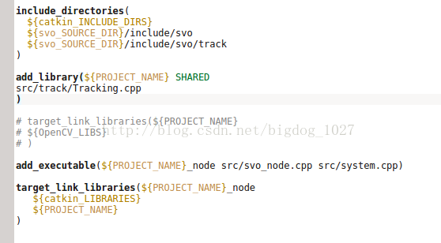

# CMakeLists.txt最关键的部分

### **一个CMakeLists最关键的部分**

```bash
cmake_minimum_required (VERSION 3.0)

project(hello)                                  # 给工程起个名字

include_directories( include_folder/)           # 指定头文件所在目录，让CMake找到我的头文件 .h
                                                # (当前目录不需要的头文件不需要include)

add_library(lib1 lib1.cpp}
add_library(lib2 lib2.cpp}
add_library(lib3 lib3.cpp}                      # 编译源文件生成链接库（库标识）

target_link_libraries(${PROJECT_NAME} lib1, lib2, lib3)     
                                                # 指定要链接哪个具体的库文件（通过前面的库标识）
link_directories( lib_folder/)                  # 指定要链接库文件所在的目录，将整个目录下的库都链接
                                                # (不同于前面库文件，这里是整个目录)
                                                
add_executable(${PROJECT_NAME} main.cpp)        # 告诉CMake主文件


set(CMAKE_CXX_COMPILER   "clang++" )            # 显示指定使用的C++编译器

set(CMAKE_CXX_FLAGS   "-std=c++11")             # c++11
set(CMAKE_CXX_FLAGS   "-g")                     # 调试信息
set(CMAKE_CXX_FLAGS   "-Wall")                  # 开启所有警告

set(CMAKE_CXX_FLAGS_DEBUG   "-O0" )             # 调试包不优化
set(CMAKE_CXX_FLAGS_RELEASE "-O2 -DNDEBUG " )   # release包优化
```



### add\_library

该指令的主要作用就是**将指定的源文件编译生成链接文件**，然后添加到工程中去。

```text
add_library(<name> [STATIC | SHARED | MODULE]
            [EXCLUDE_FROM_ALL]
            [source1] [source2] [...])
```

* 其中&lt;name&gt;表示库文件的名字，该库文件会根据命令里列出的源文件来创建。
* STATIC、SHARED和MODULE的作用是指定生成的库文件的类型。

  * STATIC库是目标文件的归档文件，在链接其它目标的时候使用。
  * SHARED库会被动态链接（动态链接库），在运行时会被加载。
  * MODULE库是一种不会被链接到其它目标中的插件，但是可能会在运行时使用dlopen-系列的函数。

  **默认状态下，库文件**将会在于**源文件目录树的构建目录树的位置**被创建，该命令也会在这里被调用。

注意：生成的可执行文件路径会在build/src目录下，如需修改生成位置，请参考CMake变量`EXECUTABLE_OUTPUT_PATH`

### target\_link\_libraries

该指令的作用为将**目标文件与库文件进行链接**。该指令的语法如下：

```text
target_link_libraries(<target> [item1] [item2] [...]
                      [[debug|optimized|general] <item>] ...)
```

* 上述指令中的&lt;target&gt;是指通过add\_executable\(\)和add\_library\(\)指令生成已经创建的目标文件。
* \[item\]表示库文件没有后缀的名字。

**target link 的顺序很重要**，如果hp\_lib中需要依赖timer\_lib，就应该把hp\_lib放在timer\_lib的前面，链接是一个**有向图的过程**

```text
target_link_libraries(main hp_lib timer_lib epoll_lib) 
```

* **默认情况下，库依赖项是传递的**。当这个目标链接到另一个目标时，链接到这个目标的库也会出现在另一个目标的连接线上。这个传递的接口存储在interface\_link\_libraries的目标属性中，可以通过设置该属性直接重写传递接口。

