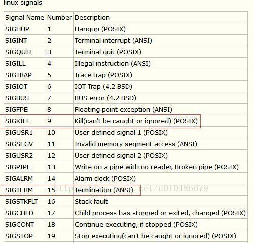

# Linux通过signal机制控制进程——kill命令，bp命令，jobs命令

`$man signal`查看信号说明

常用信号：

* SIGINT:  Ctrl-C
* SIGQUIT:  Ctrl-\
* SIGHUP: 窗口/登录中断
* SIGKILL
* SIGTERM
* SIGSTOP：Ctrl-Z

信号表：



当我们输入 `Ctrl-C` 时，shell 会发送一个`SIGINT` 信号到进程。

shell 会使用 UNIX 提供的信号机制执行进程间通信。当一个进程接收到信号时，它会停止执行、处理该信号并基于信号传递的信息来改变其执行。

当然还有其他的中止命令, `Ctrl-\`shell 会发送一个`SIGQUIT` 信号到进程。

### 捕获并忽略中断信号，防止别人ctrl+c我的程序

展示了捕获信号`SIGINT` 并忽略它的基本操作，它并不会让程序停止。为了停止这个程序，我们需要使用`SIGQUIT` 信号，通过输入`Ctrl-\`可以发送该信号。

```python
#!/usr/bin/env python
import signal, time

def handler(signum, time):
    print("\nI got a SIGINT, but I am not stopping")

signal.signal(signal.SIGINT, handler)
i = 0
while True:
    time.sleep(.1)
    print("\r{}".format(i), end="")
    i += 1
```

这个程序发送两次 `SIGINT` ，都被捕获然后忽略了，然后再发送一次 `SIGQUIT`，程序会有什么反应？注意 `^` 是我们在终端输入`Ctrl` 时的表示形式：

```bash
$ python sigint.py
24^C
I got a SIGINT, but I am not stopping
26^C
I got a SIGINT, but I am not stopping
30^\[1]    39913 quit       python sigint.py
```

尽管 `SIGINT` 和 `SIGQUIT` 都常常用来发出和终止程序相关的请求。`SIGTERM` 则是一个更加通用的、也更加优雅地退出信号。为了发出这个信号我们需要使用 [`kill`](http://man7.org/linux/man-pages/man1/kill.1.html) 命令, 它的语法是： `kill -TERM <PID>`。

### kill命令可以控制中断类型

`SIGTERM: kill -TERM <PID>`最推荐的kill方式

`SIGHUP: kill -HUP <PID>`

`SIGSTOP: kill -STOP <PID>`

 `SIGKILL` 是一个特殊的信号，它不能被进程捕获并且它会马上结束该进程。不过这样做会有一些**副作用，例如留下孤儿进程。**

**之前经常使用的kill -9就是`SIGKILL`，**所以如果sh调用一个python运行程序，把python这个进程SIGKILL了**，那么原本sh的进程就成了孤儿进程**

**参数与前面的signal 表一致**

### bg恢复suspended进程

有些信号：`SIGSTOP`和`SIGKILL`无法被捕获和忽略的

`SIGSTOP`是`Ctrl-Z`会使进程进入suspended状态

**jobs命令**可以查看进程状态

```bash
$ jobs
[1]  + suspended  sleep 1000
[2]  - running    nohup sleep 2000
```

**bp命令**可以恢复suspended进程

```bash
$ bg %1
[1]  - 18653 continued  sleep 1000

$ jobs
[1]  - running    sleep 1000
[2]  + running    nohup sleep 2000
```

### 如果ssh断开连接/终端关闭，会发送说明信号呢？

ssh断开连接会发送hangup信号也就是`SIGHUP`

一旦您关闭终端（会发送另外一个信号`SIGHUP`），这些后台的进程也会终止。

 可以使用 [`nohup`](http://man7.org/linux/man-pages/man1/nohup.1.html) \(一个用来忽略 `SIGHUP` 的封装\) 来运行程序。针对已经运行的程序，可以使用`disown` 。

