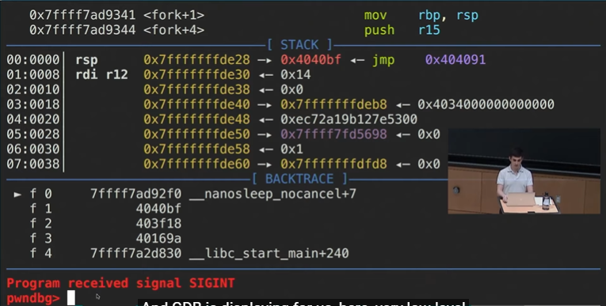

# gdb——动态调试

gdb不仅能调试很多编程语言，例如C++，C，Java之类的

其实可以调试任何二进制的东西

```bash
$ gdb --args sleep 20
...#输出很多信息
pwndbg> run #可以打断当前运行的东西
```

**分为四个部分入门：**

* 启动调试
* 断点设置
* 变量查看
* 单步调试

**关键: 要学会设置断点breakpoint+监控变量变化print/display+一步一步调试step**

**其他功能：**

gdb可以展示很多底层的东西，我们可以在这个例子看到stacktrace以及nanosleep function



