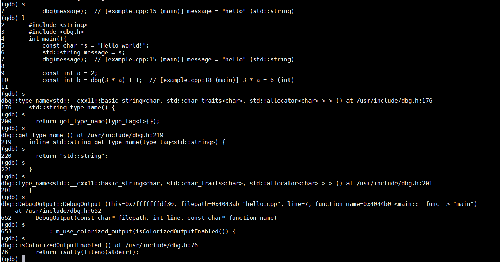

# 单步调试

启动调试设置断点观察之后，没有我们想要的信息怎么办呢？这个时候，就需要单步执行或者跳过当前断点继续执行

本文所说的单步调试并非仅仅指单步执行，而是指**在你的控制之下，按要求执行语句。**

先准备一个示例程序如下：

```cpp
/*gdbStep.c*/
#include<stdio.h>
/*计算简单乘法,这里没有考虑溢出*/
int add(int a, int b)
{
    int c = a + b;
    return c;
}
/*打印从0到num-1的数*/
int count(int num)
{
    int i = 0;
    if(0 > num)
        return 0;
    while(i < num)
    {
        printf("%d\n",i);
        i++;
    }
    return i;
}
int main(void)
{
    int a = 3;
    int b = 7;
    printf("it will calc a + b\n");
    int c = add(a,b);
    printf("%d + %d = %d\n",a,b,c);
    count(c);
    return 0;
}
```

编译：

```bash
$ gcc -g -o gdbStep gdbStep.c
```

### **单步执行——next**

next命令（可简写为n）用于在程序断住后，继续执行下一条语句，假设已经启动调试，并在第25行停住，如果要继续执行，则使用n执行下一条语句，**如果后面跟上数字num，则表示执行该命令num次**，就达到**继续执行n行的效果**了：

```bash
$ gdb gdbStep     #启动调试
(gdb)> b 25       #将断点设置在12行
(gdb)> run        #运行程序
Breakpoint 1, main () at gdbStep.c:25
25        int b = 7;
(gdb)> n          #单步执行
26        printf("it will calc a + b\n");
(gdb)> n 2        #执行两次
it will calc a + b
28        printf("%d + %d = %d\n",a,b,c);
```

从上面的执行结果可以看到，我们在25行处断住，执行n之后，运行到26行，运行n 2之后，运行到28行，但是有没有发现一个问题，为什么不会进入到add函数内部呢？那就需要用到另外一个命令啦。

### **单步进入——step**

对于上面的情况，如果我们想跟踪add函数内部的情况，可以使用step命令（可简写为s），它可以单步跟踪到函数内部，但前提是该函数有调试信息并且有源码信息。

```bash
$ gdb gdbStep     #启动调试
(gdb)> b 25       #在12行设置断点
Breakpoint 1 at 0x4005d3: file gdbStep.c, line 25.
(gdb)> run        #运行程序
Breakpoint 1, main () at gdbStep.c:25
25        int b = 7;
(gdb)> s          
26        printf("it will calc a + b\n");
(gdb)> s          #单步进入printf，但是并没有该函数的源文件信息
_IO_puts (str=0x4006b8 "it will calc a + b") at ioputs.c:33
33    ioputs.c: No such file or directory.
(gdb)> finish     #继续完成该函数调用
Run till exit from #0  _IO_puts (str=0x4006b8 "it will calc a + b")
    at ioputs.c:33
it will calc a + b
main () at gdbStep.c:27
27        int c = add(a,b);
Value returned is $1 = 19
(gdb)> s          #单步进入，现在已经进入到了add函数内部
add (a=13, b=57) at gdbStep.c:6
6        int c = a + b;
```

**s命令**会尝试进入函数，但是如果没有该函数源码，需要跳过该函数执行，可使用**finish命令**，继续后面的执行。

**如果没有函数调用，s的作用与n的作用并无差别，仅仅是继续执行下一行**。它后面也可以跟数字，表明要执行的次数。

当然它还有一个选项，用来设置当遇到没有调试信息的函数，s命令是否跳过该函数，而执行后面的。默认情况下，它是会跳过的，即step-mode值是off：

```bash
(gdb)> show step-mode 
Mode of the step operation is off.
(gdb)> set step-mode on
(gdb)> set step-mode off
```

还有一个与step相关的命令是**stepi（可简写为si）**，它与step不同的是，**每次执行一条机器指令**：

```bash
(gdb)> si
0x0000000000400573    6       int c = a + b;
(gdb)> display/i $pc
1: x/i $pc
=> 0x400573 <add+13>:    mov    -0x18(%rbp),%eax
(gdb)
```

#### 关于step的示例：可以一步一步进入函数的调用栈里面



### **执行到下一个断点——continue**

我们可能打了多处断点，或者断点打在循环内，这个时候，想跳过这个断点，甚至跳过多次断点继续执行该怎么做呢？可以使用**continue命令（可简写为c）**或者**fg**，**它会继续执行程序，直到再次遇到断点处**：

```bash
$ gdb gdbStep
(gdb)> b 18    #在count函数循环内打断点
(gdb)> run
Breakpoint 1, count (num=10) at gdbStep.c:18
18            i++;
(gdb)> c       #继续运行，直到下一次断住
Continuing.
1
Breakpoint 1, count (num=10) at gdbStep.c:18
18            i++;
(gdb)> fg       #继续运行，直到下一次断住
Continuing.
2

Breakpoint 1, count (num=10) at gdbStep.c:18
18            i++;
(gdb)> c 3    #跳过三次
Will ignore next 2 crossings of breakpoint 1.  Continuing.
3
4
5

Breakpoint 1, count (num=10) at gdbStep.c:18
18            i++;
```

### **继续运行到指定位置——until**

假如**我们在25行停住了，现在想要运行到29行停住**，就可以使用**until命令（可简写为u）**：

```bash
$ gdb gdbStep
(gdb)> b 25
(gdb)> run
(gdb)> u 29
it will calc a + b
3 + 7 = 10
main () at gdbStep.c:29
29        count(c);
(gdb)>
```

可以看到，在执行u 29之后，它在29行停住了。它利用的是临时断点。

### **跳过执行——skip**

**skip可以在step时跳过一些不想关注的函数或者某个文件的代码:**

```bash
$ gdb gdbStep
(gdb)> b 27
Breakpoint 1 at 0x4005e4: file gdbStep.c, line 27.
(gdb)> skip function add    #step时跳过add函数
Function add will be skipped when stepping.
(gdb)> info skip   #查看step情况
Num     Type           Enb What
1       function       y   add
(gdb)> run
Starting program: /home/hyb/workspaces/gdb/gdbStep 
it will calc a + b

Breakpoint 1, main () at gdbStep.c:27
27        int c = add(a,b);
(gdb)> s
28        printf("%d + %d = %d\n",a,b,c);
(gdb)
```

可以看到，**再使用skip之后，使用step将不会进入add函数**。

**skip也后面也可以跟文件**：这样gdbStep.c中的函数都不会进入

```bash
(gdb)> skip file gdbStep.c
```

其他相关命令：

* skip delete \[num\] 删除skip
* skip enable \[num\] 使能skip
* skip disable \[num\] 去使能skip

其中num是前面通过info skip看到的num值，上面可以带或不带该值，如果不带num，则针对所有skip，如果带上了，则只针对某一个skip。

