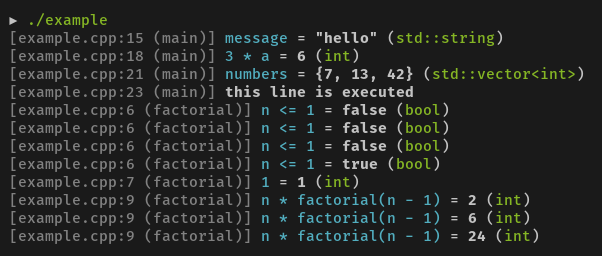

# log工具

### dbg-macro（C++11或更高）

[https://github.com/sharkdp/dbg-macro](https://github.com/sharkdp/dbg-macro)

推荐原因：

* 多色彩高亮
* 可以输出vector,string等STL对象
* 调用简单：只用`#include<dbg.h>`,而且只用把dbg.h放在一个可以include到的地方就可以了（可以放在当前目录）
* 使用简单：只用一句dbg\(object\)，适用于小型项目或者leetcode题目

