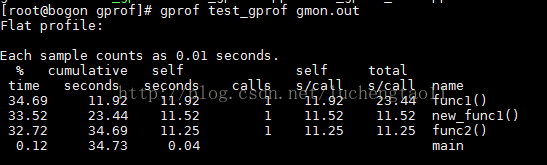
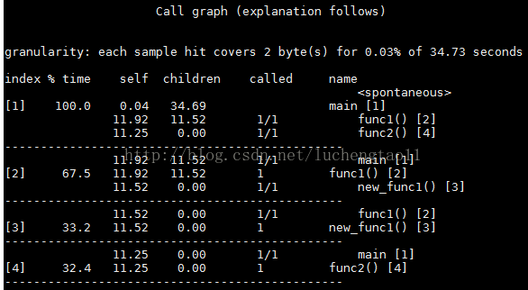

# gprof——性能分析：运行时长和调用

gprof，需要在编译时，加入-pg选项

```bash
$ g++ -pg test_gprof.cpp -o test_gprof
```

可以看到执行后会新生成一个gmon.out文件

另外只有在程序正常退出后才会生成gmon.out，kill进程的方法是没法生成gmon.out的。对于那些线程会一直run的服务，需要修改代码，让程序在某个时间点停止。

运行性能测试工具

```bash
$ gprof test_gprof gmon.out # 会在屏幕上显示各种输出信息
# 或者将信息输出到一个报告里查看
$ gprof -b test_gprof gmon.out >>report.txt
```

（1）flat profile，包括每个函数的**调用次数**，以及每个函数**消耗的处理器时间**



（2）call graph包括函数的**调用关系**，每个函数**调用花费的时间**



**可视化**

gprof的结果文件需要借助gprof2dot.py和graphviz来展示

使用gprof2dot.py生成dot文件

python gprof2dot.py report.txt &gt;report.dot

dot的打开需要graphviz工具，我是在windows下安装的graphviz，这个工具下载很简单。下载后使用gvedit.ext打开前一个步骤产生的report.dot文件即可

