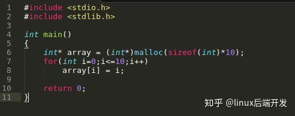

# valgrind——内存检测

[https://zhuanlan.zhihu.com/p/75328270](https://zhuanlan.zhihu.com/p/75328270)

在Linux系统下**内存检测工具首推Valgrind**，一款非常好用的开源内存管理框架。Valgrind其实是一个工具集，内存错误检测只是它众多功能的一个，但我们用得**最多的功能正是它——memcheck**。

valgrind不是linux的原生工具，需要自行安装。valgrind自身包含了多个工具：

* Memcheck：用于内存泄漏检查
* Callgrind：用于性能分析，会收集程序运行时间和调用关系
* 以及Cachegrind、Helgrind等

该工具可以检测下列与内存相关的问题 :

* 未释放内存的使用
* 对释放后内存的读/写
* 对已分配内存块尾部的读/写
* 内存泄露
* 不匹配的使用malloc/new/new\[\] 和 free/delete/delete\[\]
* 重复释放内存

### **安装**

valgrind下载：[**https://www.valgrind.org/downloads/valgrind-3.12.0.tar.bz2valgrind**](https://www.valgrind.org/downloads/valgrind-3.12.0.tar.bz2valgrind)\*\*\*\*

安装：

```bash
$ tar -jxvf valgrind-3.12.0.tar.bz2
$ cd valgrind-3.12.0
$ ./configure
$ make
$ sudo make install
```

### **C++中Valgrind的应用场景**

注意: 下面讨论的所有测试代码都应该使用gcc/g++并且加上-g选项。

**1.使用未初始化的内存（使用野指针）**

这里我们定义了一个指针p，但并未给他开辟空间，即他是一个野指针，但我们却使用它了。


Valgrind检测出我们程序使用了未初始化的变量，但并未检测出内存泄漏。


**2.在内存被释放后进行读/写（使用野指针）**

p所指向的内存被释放了，p变成了野指针，但是我们却继续使用这片内存。


Valgrind检测出我们使用了已经free掉的内存，并给出这片内存是哪里分配哪里释放的。

**3.从已分配内存块的尾部进行读/写（动态内存越界）**

我们动态地分配了一段数组，但我们在访问个数组时发生了越界读写，程序crash掉。



Valgrind检测出越界的位置。


注意：Valgrind**不检查静态分配数组的使用情况**！所以对静态分配的数组，Valgrind表示无能为力！比如下面的例子，程序crash掉，我们却不知道为什么。


**4.内存泄漏**

内存泄漏的原因在于**没有成对地使用malloc/free和new/delete**，比如下面的例子。


Valgrind会给出程序中malloc和free的出现次数以判断是否发生内存泄漏，比如对上面的程序运行memcheck，Valgrind的记录显示上面的程序用了1次malloc，却调用了0次free，明显发生了内存泄漏！

上面提示了我们可以**使用--leak-check=full进一步获取内存泄漏的信息**，**比如malloc和free的具体行号**。


5. **不匹配地使用malloc/new/new\[\] 和 free/delete/delete\[\]**

正常使用new/delete和malloc/free是这样子的：


而不匹配地使用malloc/new/new\[\] 和 free/delete/delete\[\]则会被提示mismacth：


**6.两次释放内存**

double free的情况同样是根据malloc/free的匹配对数来体现的，比如free多了一次，Valgrind也会提示。


当然，Valgrind也不是万能的。Valgrind也有无法找到问题的时候，有些问题只能通过不断的review代码找到了症结。

