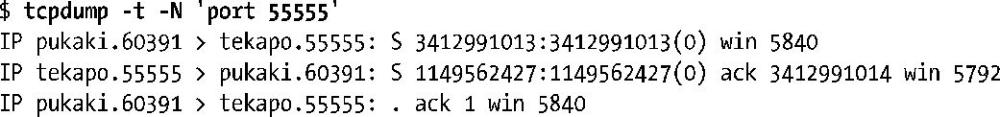
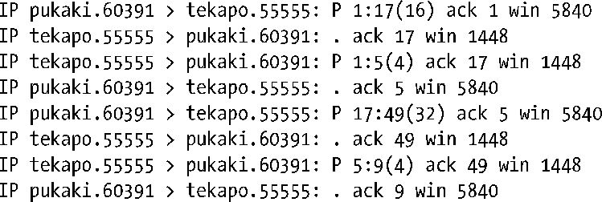

# tcpdump命令

让超级用户**监**视网络中的实时流量，实时生成文本**信息**

实际上它可以用来显示所有类型的 TCP/IP 数据包流量（例如，TCP 报文、UDP 数据报以及 ICMP 报文）

对于**每个网络报文**，tcpdump 都会显示出像**时间戳、源 IP 地址、目的IP地址**以及更多协议特有的细节信息

示例：

这三个报文是在三次握手时交换的SYN、SYN/ACK以及ACK（参见图61-5）。

在接下来的输出中，客户端发送给服务器两条消息，分别包含有16和32字节。而服务器每次都响应一条4字节的消息。

