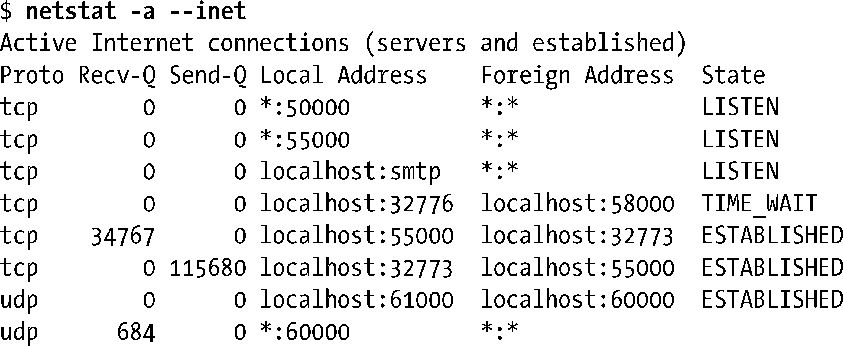

# netstat命令

### **监视套接字**

| 选项 | 描述 |
| :--- | :--- |
| -a | 显示所有套接字的信息，包括监听套接字 |
| -e | 显示出扩展信息（包括套接字属主的用户ID） |
| -c | 连续重新显示套接字信息（每秒刷新显示一次） |
| -l | 只显示监听套接字的信息 |
| -n | 显示IP地址、端口号并以数字形式显示出用户名称 |
| -p | 显示进程ID号以及套接字所归属的程序名称 |
| --inet | 显示Internet域套接字的信息 |
| --tcp | 显示Internet域TCP（流）套接字的信息 |
| --udp | 显示Internet域UDP（数据报）套接字的信息 |
| --unix | 显示UNIX域套接字的信息 |

示例：使用 netstat 来列出当前系统上所有的 Internet 域套接字信息，下面是输出。

* Recv-Q：表示套接字接收缓冲区中还未被本地应用读取的字节数。对于 UDP 套接字来说，该字段不只包含数据，还包含 UDP 首部及其他元数据所占的字节。
* Send-Q：表示套接字发送缓冲区中排队等待发送的字节数。和Recv-Q字段一样，对于UDP套接字，该字段还包含了 UDP 首部和其他元数据所占的字节。
* Local Address：该字段表示套接字绑定到的地址，以主机IP:端口号的形式表示。默认情况下，主机地址和端口号都以名称形式来显示，除非数值形式无法解析到对应的主机和服务名称。地址中主机部分的星号（\*）表示这是一个通配IP地址。
* Foreign Address：这是对端套接字所绑定的地址。字符串\*:\*表示没有对端地址。
* State：表示当前套接字所处的状态

