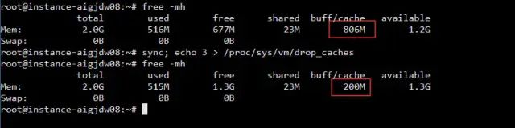

# free命令——内存，缓存，swap虚拟内存

### **free命令的解释**

* total 总内存
* used 已用内存
* free 空闲内存（并不是用户可分配的实际内存，available才是）
* buff/cache 已使用的缓存
  * buffer和cache用于提升IO性能的缓存，用户如果真的需要更大的内存，缓存这部分会被内存管理器自动释放来给用户腾出空间
  * **buffer与cache的区别**、
    * A buffer is something that has yet to be “written” to disk.
    * A cache is something that has been “read” from the disk and stored for later use.
  * buffer用于存放要输出到磁盘的数据，而cache是从磁盘读出存放到内存中待今后使用的数据。它们的引入均是为了提高IO的性能。
* available 可用内存：是用户可分配的内存
  * 一般用户可分配的内存大致是**free + buff/cache**差不多是available


**Linux** 内存管理采取了两种主要Cache方式：**Buffer Cache**和**Page Cache**，目的就是为了提升磁盘IO的性能

**设计思想是内存空闲还不如拿来多缓存一些数据**，等下次程序再次访问这些数据速度就快了，而**如果程序要使用内存而系统中内存又不足**时，这时不是使用交换分区，而是**快速回收部分缓存**，将它们留给用户程序使用。

### 清理缓存

`sync; echo 3 > /proc/sys/vm/drop_caches`就可以清理`buff/cache`了



这里面的buff/cache就包含mysql中的join\_buffer\_size，以及各种Buffer block和cache block

清除完之后，可能很多应用程序下次访问就变慢了

```text
To free pagecache: 
$ echo 1 > /proc/sys/vm/drop_caches
To free dentries and inodes: 
$ echo 2 > /proc/sys/vm/drop_caches
To free pagecache, dentries and inodes: 
$ echo 3 > /proc/sys/vm/drop_caches
```

### 虚拟内存,swap空间

磁盘上留出一块来充当内存的地方

**作用：**相当于给内存增加了空间，如果原本内存不够用可以用swap空间

**缺点：**磁盘上IO的速度特别慢，所以导致当用到swap空间时，系统往往会表现得很不流畅

示例：

在Windows下资源管理器查看内存使用的情况，如果使用率达到80%以上，再运行大程序就能感觉到系统不流畅了，因为在内存紧缺的情况下使用交换分区，频繁地从磁盘上换入换出页会极大地影响系统的性能。而当我们使用free命令查看Linux系统内存使用情况时，会发现内存使用一直处于较高的水平，即使此时系统并没有运行多少软件。

