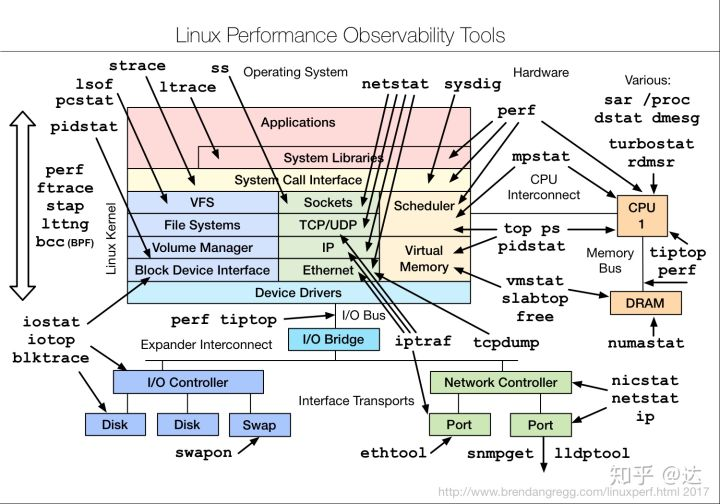

# Linux性能观察工具一览



### **cpu监控命令**

**pidstat**

* PID：进程ID

  %usr：进程在用户空间占用cpu的百分比

  %system：进程在内核空间占用cpu的百分比

  %guest：进程在虚拟机占用cpu的百分比

  %CPU：进程占用cpu的百分比

  CPU：处理进程的cpu编号

  Command：当前进程对应的命令


**mpstat**

* MultiProcessor Statistics 

  报告CPU的一些统计信息，这些信息存放在/proc/stat文件中。在多CPUs系统里，其不但能查看所有CPU的平均状况信息，而且能够查看特定CPU的信息。

  * **-P {\|ALL}：**表示监控哪个CPU，在\[0,cpu个数-1\]中取值；
  * **internal：**相邻的两次采样的间隔时间；
  * **count：**采样的次数，count只能和delay一起使用；

* 显示所有的CPU信息：mpstat -P ALL 1（间隔为1s）


* 显示ID为1的CPU信息：mpstat -P 1 1（间隔为1s）

### **内存监控命令**

**vmstat**

* 内存使用
* 虚拟内存交换情况
* IO读写情况
* CPU使用率

  $ vmstat 2 表示每两秒采集一次服务器状态，输出

  $ vmstat 就是直接显示一次采样的数据

```csharp
procs -----------memory----------- ---swap-- -----io---- -system-- ------cpu-----
 r  b   swpd   free   buff   cache   si   so   bi    bo   in   cs  us sy id wa st
 1  0 382976 4720900 2183488 22734120 0   1   273     8    0    0  12  5 82  1  0
```

* **swpd** 虚拟内存已使用的大小
* **free**   空闲的物理内存的大小，剩余4G多。

  **buff**   Linux/Unix系统是用来存储，目录里面有什么内容，权限等的缓存，我本机大概占用300多M

  **cache** cache直接用来记忆我们打开的文件,给文件做缓冲，我本机大概占用300多M\(这里是Linux/Unix的聪明之处，把空闲的物理内存的一部分拿来做文件和目录的缓存，是为了提高 程序执行的性能，当程序使用内存时，buffer/cached会很快地被使用。\)

  **si**  每秒从磁盘读入虚拟内存的大小，如果这个值大于0，表示物理内存不够用或者内存泄露了，要查找耗内存进程解决掉。我的机器内存充裕，一切正常。

  **so**  每秒虚拟内存写入磁盘的大小，如果这个值大于0，同上。

  **bi**  块设备每秒接收的块数量，这里的块设备是指系统上所有的磁盘和其他块设备，默认块大小是1024byte，我本机上没什么IO操作，所以一直是0，但是我曾在处理拷贝大量数据\(2-3T\)的机器上看过可以达到140000/s，磁盘写入速度差不多140M每秒

  **bo** 块设备每秒发送的块数量，例如我们读取文件，bo就要大于0。bi和bo一般都要接近0，不然就是IO过于频繁，需要调整。

  **in** 每秒CPU的中断次数，包括时间中断

  **cs** 每秒上下文切换次数，例如我们调用系统函数，就要进行上下文切换，线程的切换，也要进程上下文切换，这个值要越小越好，太大了，要考虑调低线程或者进程的数目,例如在apache和nginx这种web服务器中，我们一般做性能测试时会进行几千并发甚至几万并发的测试，选择web服务器的进程可以由进程或者线程的峰值一直下调，压测，直到cs到一个比较小的值，这个进程和线程数就是比较合适的值了。系统调用也是，每次调用系统函数，我们的代码就会进入内核空间，导致上下文切换，这个是很耗资源，也要尽量避免频繁调用系统函数。上下文切换次数过多表示你的CPU大部分浪费在上下文切换，导致CPU干正经事的时间少了，CPU没有充分利用，是不可取的。

  **us** 用户CPU时间，我曾经在一个做加密解密很频繁的服务器上，可以看到us接近100,r运行队列达到80\(机器在做压力测试，性能表现不佳\)。

  **sy** 系统CPU时间，如果太高，表示系统调用时间长，例如是IO操作频繁。

  **id**  空闲 CPU时间，一般来说，id + us + sy = 100,一般我认为id是空闲CPU使用率，us是用户CPU使用率，sy是系统CPU使用率。

  **wt** 等待IO CPU时间。

