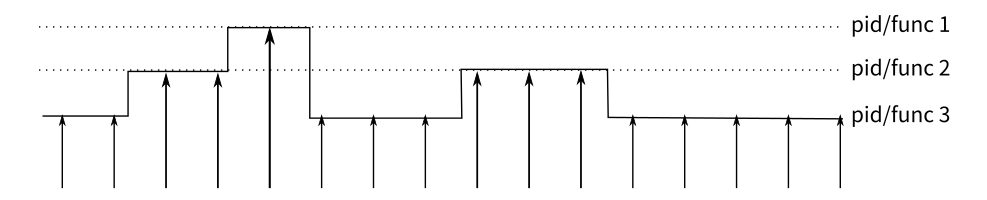

# perf命令——事件分析

### **perf火焰图使用！！**

\*\*\*\*[**http://senlinzhan.github.io/2018/03/18/perf/**](http://senlinzhan.github.io/2018/03/18/perf/)\*\*\*\*

### **perf简介**

**Linux自带**

[`perf`](http://man7.org/linux/man-pages/man1/perf.1.html) 命令将 CPU 的区别进行了抽象，它不会报告时间和内存的消耗，而是报告与您的程序相关的系统事件。

例如，`perf` 可以报告不佳的缓存局部性（poor cache locality）、大量的页错误（page faults）或活锁（livelocks）。下面是关于常见命令的简介：

* `perf list` - 列出可以被 pref 追踪的事件；
* `perf stat COMMAND ARG1 ARG2` - 收集与某个进程或指令相关的事件；
* `perf record COMMAND ARG1 ARG2` - 记录命令执行的采样信息并将统计数据储存在`perf.data`中；
* `perf report` - 格式化并打印 `perf.data` 中的数据。

### **perf的原理：中断采样**

每隔一个固定的时间，就在CPU上（每个核上都有）产生一个中断，在中断上看看，当前是哪个pid，哪个函数，然后给对应的pid和函数加一个统计值，这样，我们就知道CPU有百分几的时间在某个pid，或者某个函数上了。这个原理图示如下：



这是一种采样的模式，我们预期，运行时间越多的函数，被时钟中断击中的机会越大，从而推测，那个函数（或者pid等）的CPU占用率就越高。

### 示例：用stress命令来测试perf

**stress命令**是来模拟系统负载较高时的场景，[**https://www.cnblogs.com/sparkdev/p/10354947.html**](https://www.cnblogs.com/sparkdev/p/10354947.html)\*\*\*\*

```bash
# 常用选项：
# -c, --cpu N              产生 N 个进程，每个进程都反复不停的计算随机数的平方根
$ sudo perf stat stress -c 1
```

ctrl+c后就可以查看到很多信息，例如page-faults次数等

```bash
$ sudo perf report # 查看报告
```

perf的结果可以生成火焰图。生成火焰图需要借助Flame Graph

Flame Graph项目位于GitHub:[https://github.com/brendangregg/FlameGraph](https://github.com/brendangregg/FlameGraph)

