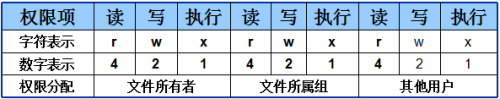
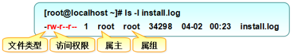

# 文件权限与文件所有

### 文件权限

linux文件权限分为 读\(read\) 写\(write\) 执行\(recute\)，简写即为\(r,w,x\),亦可用数字来\(4,2,1\)表示

同时权限分配分为三个级别：文件所有者，文件所属组，其他用户



所以修改权限时，777就表示全部权限都允许

```text
$ sudo chmod 777 file
```

查看文件权限，可以使用ls -l



（drwxr-xr-x 解释）

第一个字符表示文件类型：-：普通文件，d:目录文件，l:链接文件，b:设备文件，c:字符设备文件，p:管道文件

后面9位对应着三个级别的权限

**普通文件**即实际保存数据的地方，其并不具备删除自身的权限：

* r：可读取文件的实际内容
* w：可编辑、新增、修改该文件的实际内容
* x：可被执行

**目录文件**即保存有目录结构和文件权限：

* r：可读取目录结构和权限
* w：可更改目录结构列表、新建、删除、重命名、转移子文件、目录
* x：表示用户可进入到该目录中

### 文件所有

修改文件所有者，组所有者

```bash
$ sudo chown [用户名] [文件名] -R # 表示递归
$ sudo chgrp [用户名] [文件名] -R 
```

